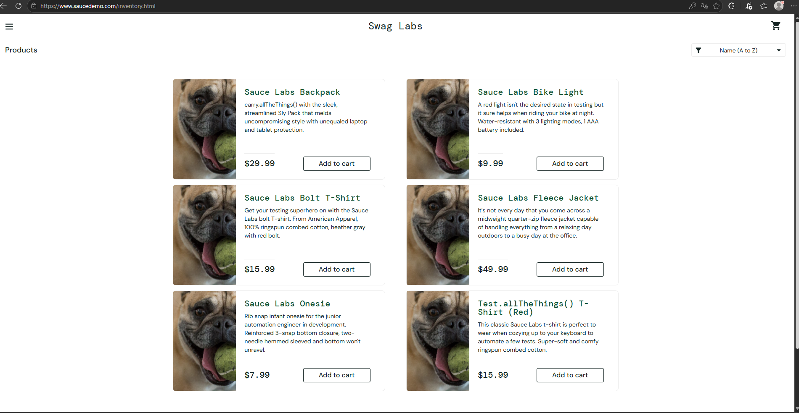

## BUG-001 produtos com imagens incorretas na seção Products 

#### Status: Aberto
#### Severidade: Médio
#### Prioridade: P2

### Dados de teste:
#### Usuario: `problem_user`
#### Senha: `secret_sauce`

### Descrição
#### Produtos com imagens que nao correspondem corretamente ao produto informado, utilizando o usuario `problem_user` 

### Pré-condições
- Estar na pagina inicial de products do SauceDemo

### Passos
1. Faça login com usuario `problem_user` / `secret_sauce`
2. Navegar para a pagina products
3. Compare a imagem com a descrição do produto informado

### Resultado esperado
O sistema deve mostrar a imagem dos produtos corretamente de acordo com a descrição

### Resultado obtido
Produtos com imagens incorretas.

### Evidencia

### Evidencia

### Informações
##### OS: Windows 11
##### navegador: Google Chrome, Microsoft Edge e Firefox

